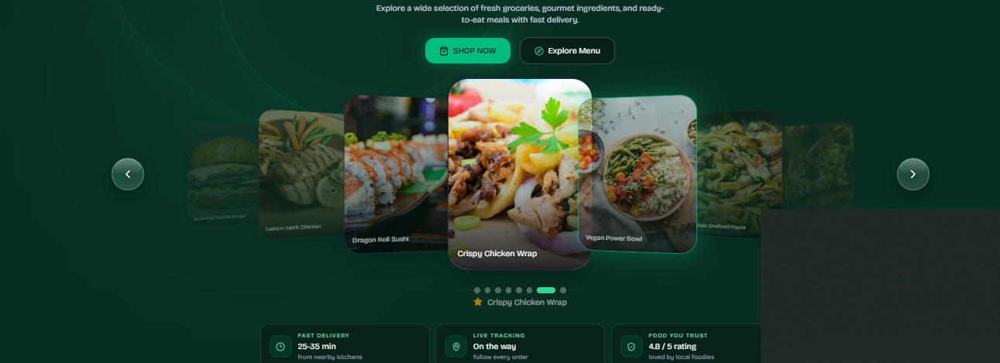
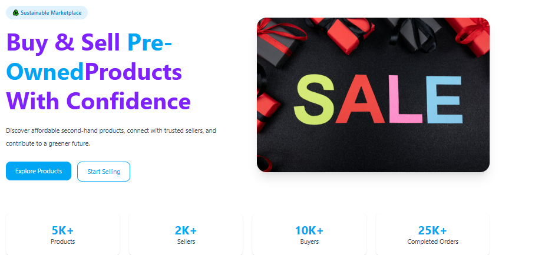
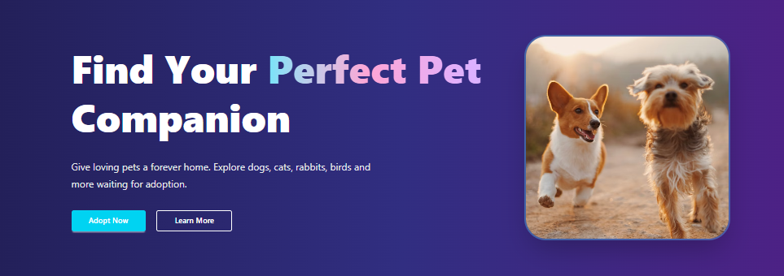

# Hi there 👋, my name is Mst. Rukshana Afrin

### I am a Full-Stack Developer

I am a Full-Stack Developer passionate about building responsive, user-friendly, and scalable web applications. I have completed a comprehensive Web Development course from Programming Hero and gained hands-on experience with HTML, CSS, JavaScript, React, Next.js, Node.js, Express.js, and MongoDB. I enjoy learning new technologies, solving problems, and building real-world projects with clean and efficient code.

📧 Email: mst.rukshanaafrin@gmail.com  
📱 Phone: 01773072299

I am currently seeking opportunities as a Full-Stack Developer where I can contribute, grow, and build impactful web solutions.

---

### Skills

  

---

- 🌱 I'm currently exploring TypeScript and Next.js
- 💼 I'm currently building full-stack web applications
- 💬 Ask me about React, Next.js, JavaScript and TypeScript
- 📚 Always learning new technologies and improving my development skills
- 📫 How to reach me: mst.rukshanaafrin@gmail.com

---

## 🚀 Featured Projects

<table>
<tr>

<td width="33%" align="center">

<h2>Team Project<h2/>
<h3>🍽️ Foodiego</h3>

<b>AI-Powered Food Delivery Platform</b>

Real-time food delivery with rider management and AI-powered features.

<b>Tech:</b> Next.js · TypeScript · Node.js · MongoDB

<a href="https://foodiego-mu.vercel.app/" target="_blank">🔗 Live Demo</a>

</td>

<td width="33%" align="center">

<h3>🛒 ReSell Hub</h3>

<b>Second-Hand Marketplace</b>

Buy and sell second-hand products with authentication and payments.

<b>Tech:</b> Next.js · MongoDB · Firebase · Stripe

<a href="https://resell-hub-client-blond.vercel.app/" target="_blank">🔗 Live Demo</a>

</td>

<td width="33%" align="center">

<h3>🐾 PawPal</h3>

<b>Pet Adoption Platform</b>

Discover and adopt pets through a simple and responsive platform.

<b>Tech:</b> Next.js · Tailwind CSS · Firebase

<a href="https://pawpal-client.vercel.app/" target="_blank">🔗 Live Demo</a>

</td>

</tr>
</table>

---

## 🔗 Connect With Me  

  
  

---

## 📊 GitHub Statistics

  
  

  

---

  <b>Thank you for visiting my profile! ⭐</b>

  <i>Always learning • Always building • Always improving</i>

---

